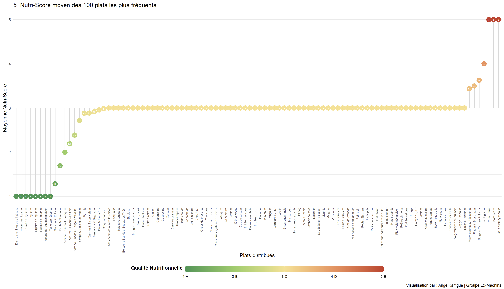

```{r setup, include=FALSE}
knitr::opts_chunk$set(echo = TRUE)
library(dplyr)
library(tibble)
library(ggplot2)
library(tidyr)
library(readr)
library(forcats)
library(scales)
``` 

# Rendu 1

## 5. Quel est le Nutri-Score moyen des 100 plats les plus fréquents ?

Nous nous intéressons à la qualité nutritionnelle de l'offre de restauration collective CROUS. Le CROUS constitue la principale solution de restauration pour la population étudiante, offrant des repas à tarif social.

L'objectif de cette section est de déterminer si les plats les plus fréquemment proposés (et donc potentiellement les plus consommés) présentent un profil nutritionnel favorable. Nous pouvons supposer que l'offre est dominée par des produits de type "snacking" ou "confort" : plats à base de pains (sandwiches, paninis), de viandes, de fromages, de légumes, ainsi que des pâtisseries. Ces catégories sont souvent associées à des apports caloriques élevés, et nous cherchons à vérifier si cette intuition se traduit par des Nutri-Scores moins favorables (D ou E).

Le Nutri-Score est un label qui facilite l’identification des aliments de bonne qualité nutritionnelle en les notant de A à E. Le meilleur Nutri-Score pour un aliment est le Score A. C'est le graal nutritionnel car il indique que l'aliment présente la meilleure qualité nutritionnelle de sa catégorie. Attention toutefois, cela ne signifie pas qu'il faut manger uniquement des produits classés A, mais qu'ils devraient constituer la base de l'équilibre alimentaire.


### Méthodologie et Nettoyage

Pour répondre à cette question, nous avons choisi une visualisation sous la forme d'un **Lollipop chart**. Ce type de graphique permet de comparer efficacement les moyennes de Nutri-scores pour chaque plat tout en conservant une grande clarté visuelle. Les données utilisées proviennent de notre dataset `liste_menus_enrichis.csv`.


Le jeu de données initial contient de nombreuses entrées textuelles qui ne sont pas des plats (consignes sanitaires, messages marketing, informations de service). Un nettoyage rigoureux a été effectué pour :

- **Exclure les messages de gestion :** ("Simple & gourmand", "Téléchargez l'application").

- **Regrouper les variantes de plats :** (fusionner tous les types de burgers, de pâtes ou de sandwiches). Il existe une grande variété de patisseries, sandwichs, pâtes,etc, qui risqueraient de fausser notre analyse.

- **Numériser le Nutri-Score :** Nous avons converti le Nutri-Score alphabétique (A-E) en échelle numérique (1-5) pour permettre le calcul d'une moyenne en fonction des regroupements effectués.

Les données utilisées sont :
- `plat` : ce sont des données nominales
- `nutriscore`: Ce sont des données nominales mais une fois converties, elles devient des données quantitatives / numériques ordinales et discrètes (de 1 à 5).


### Visualisation et analyse

Le graphique ci-dessous utilise un format **"Lollipop" divergent**. 

La ligne pointillée centrale représente le Nutri-Score C (valeur 3). Nous avons choisi cette valeur car il s'agit de la médiane des Nutri-scores. 
Visuellement, cela permet également de créer un graphique divergent : tout ce qui part à gauche (vers 1 et 2) est statistiquement "au-dessus de la moyenne théorique", et tout ce qui part à droite (4 et 5) est "en-dessous". Cela nous permet donc de distinguer d'un coup d'œil les plats "plutôt sains" des plats "plutôt gourmands". 
Enfin, C est le pivot : ce sont des aliments dont la qualité nutritionnelle est jugée "moyenne" ou "neutre".

Les plats s'étendant vers la gauche (vert) ont un score moyen plus sain, tandis que ceux s'étendant vers la droite (rouge) présentent un score plus élevé (moins favorable). Ce choix de couleurs s'aligne également avec le mode de labelisation du nutriscore dans les grandes surfaces.

Par souci de lisibilité, nous avons également choisi de placer les plats en abcisses et les valeurs numériques de nutri-score en ordonnées


 


### Interprétation des résultats
À la lecture de ce graphique, nous observons que :

- Les plats équilibrés : Les soupes, salades composées et plats à base de légumineuses se concentrent sous la barre des 3, affichant des scores A et B.

- Le cœur de l'offre : Une grande partie des plats cuisinés (viandes blanches, pâtes) oscille autour du pivot C.

- Les options "plaisir" : Les burgers, pizzas et surtout les viennoiseries s'élèvent vers les scores 4 (D) et 5 (E), ce qui confirme notre hypothèse initiale sur la densité calorique de l'offre snacking.


## Question 16 : La diversité des plats varie-t-elle selon la région ?

Pour répondre à cette question, nous procédons en trois grandes étapes :

- **Préparation des données** : Les deux sources disponibles — la liste des restaurants et les menus — sont chargées puis combinées, de façon à associer à chaque plat la région du restaurant qui le propose. Les entrées sans région identifiée sont exclues de l'analyse.
- **Mesure de la diversité** : Pour chaque région, nous calculons le nombre de plats distincts présents dans l'ensemble des menus. C'est cette métrique qui sert d'indicateur de diversité : une région proposant une grande variété de plats différents sera considérée comme plus diverse qu'une région dont les menus se répètent.
- **Visualisation** : Les régions sont ensuite classées par ordre croissant de diversité et représentées sous forme d'un graphique en barres horizontales, ce qui permet de comparer d'un coup d'œil les écarts entre territoires.

```{r}
# ── 0. Chargement ────────────────────────────────────────────
restaurants <- read_csv("data/liste_restaurants.csv",
                        show_col_types = FALSE)

menus <- read_csv("data/menus_complets_enrichis.csv",
                  show_col_types = FALSE)

# ── 1. Jointure : on rattache la région à chaque ligne de menu ─
df <- menus %>%
  left_join(
    restaurants %>% select(code, region = `region.libelle`),
    by = c("restaurant_id" = "code")
  ) %>%
  filter(!is.na(region))

# ── 2. Métrique : Définir la diversité comme le nombre de plats distincts dans les menus pour chaque région
diversite <- df %>%
  group_by(region) %>%
  summarise(
    n_menus        = n(),
    n_plats_uniq   = n_distinct(plat),
    n_categories   = n_distinct(categorie),
    n_restaurants  = n_distinct(restaurant_id),
    plats_par_rest = n_plats_uniq / n_restaurants,
    .groups = "drop"
  ) %>%
  arrange(desc(n_plats_uniq))

# ── 3. Bar plot : on affiche un bar plot représentant la diversité pour chaque région par ordre croissant
diversite %>%
  mutate(region = fct_reorder(region, n_plats_uniq)) %>%
  ggplot(aes(x = n_plats_uniq, y = region, fill = n_plats_uniq)) +
  geom_col(show.legend = FALSE) +
  geom_text(aes(label = n_plats_uniq),
            hjust = -0.15, size = 3, color = "grey30") +
  scale_fill_gradient(low = "#b7dde8", high = "#1a6fa8") +
  scale_x_continuous(expand = expansion(mult = c(0, .12))) +
  labs(
    title    = "Diversité des plats par région",
    subtitle = "Nombre de plats distincts présents dans les menus",
    x        = "Nombre de plats distincts",
    y        = NULL
  ) +
  theme_minimal(base_size = 12) +
  theme(
    plot.title    = element_text(face = "bold", size = 14),
    panel.grid.major.y = element_blank()
  )
```

On remarque donc que la région avec la plus grande diversité de plats et le Nord (Lille) avec 450 plats distincts. On se rend également compte que la différence entre le premier (Lille) et le deuxième (Normandie) est de plus de 100 ce qui nous montrent une vraie disparité dans la diversité des plats en fonction des régions.


# Conclusion

# Annexe
