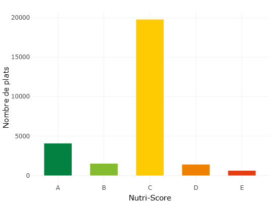
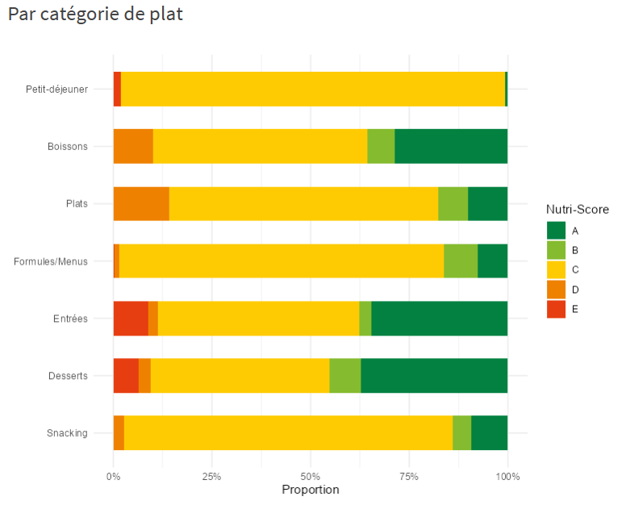
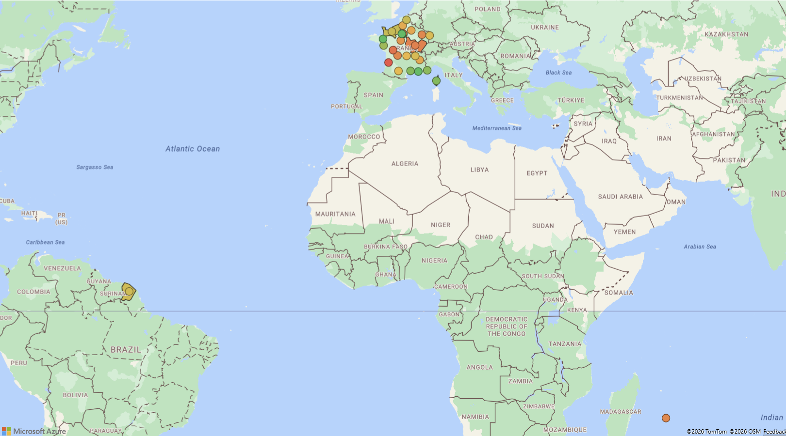
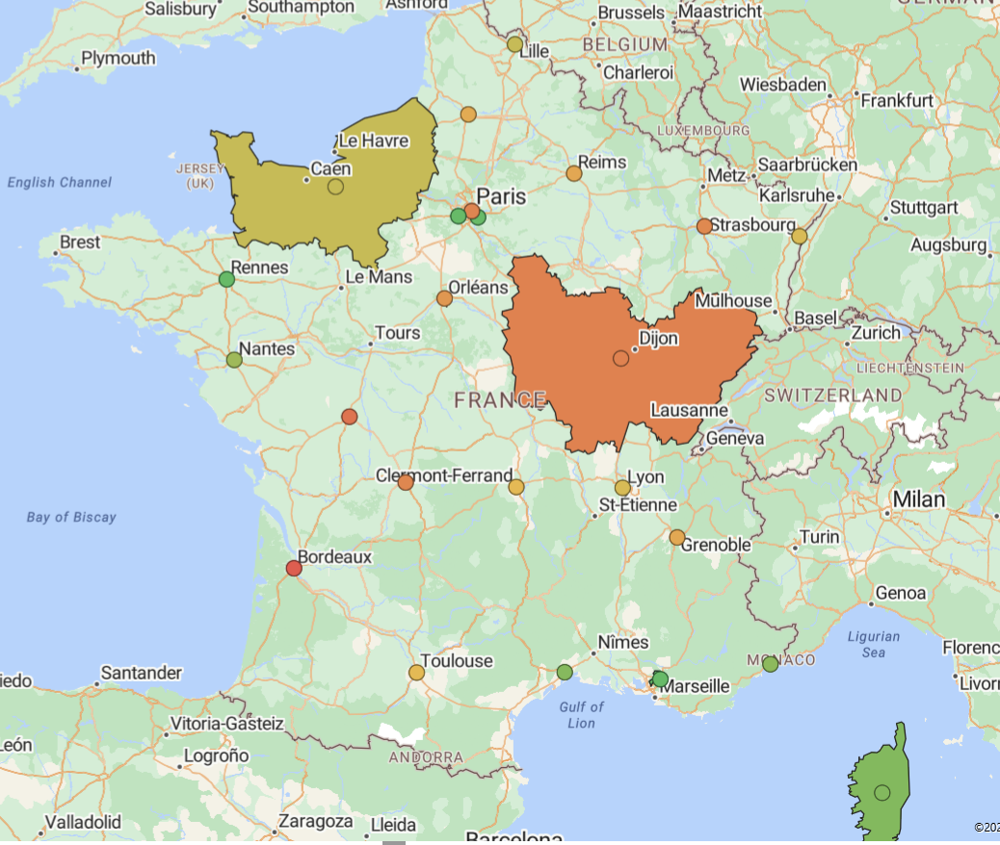
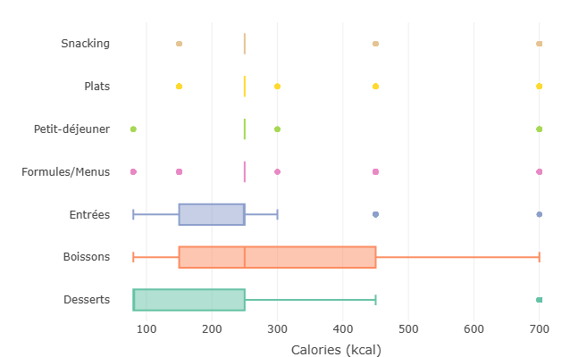
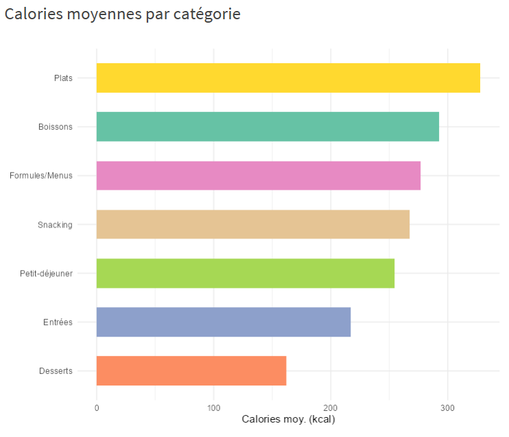

```{r setup, include=FALSE}
knitr::opts_chunk$set(echo = TRUE)
library(dplyr)
library(tibble)
library(ggplot2)
library(tidyr)
library(readr)
library(forcats)
library(scales)
```

# Introduction

Ce projet s'inscrit dans le domaine de l'analyse de données appliquée à la restauration universitaire CROUS. Il repose sur l'exploitation des données fournies par l'API **Croustillant Menu** (<https://api.croustillant.menu/>) qui permet de récupérer les menus des restaurants ainsi que les détails des plats proposés.

Le projet a pour objectif de réaliser une **analyse exploratoire** des menus et des restaurants afin de :

-   Identifier les tendances dans l'offre culinaire selon les restaurants et les périodes (ex. février 2026)\
-   Analyser la diversité des plats et des catégories (Entrées, Plats, Desserts)\
-   Comparer les menus entre restaurants et observer des régularités ou anomalies\
-   Détecter des insights exploitables pour des analyses plus avancées (ex. popularité des plats, types de repas les plus fréquents)

## Présentation des données

Le jeu de données comporte plusieurs fichiers CSV situés dans le dossier `data/` :

### 1. **`liste_restaurants.csv`** : liste des restaurants distincts

-   **Nombre d'observations :** 942 (correspond au nombre de restaurants présents dans le fichier CSV)\
-   **Nombre de variables :** 20

| Champ | Type | Description |
|------------------------|------------------------|------------------------|
| `code` | entier | Identifiant unique du restaurant |
| `nom` | texte | Nom du restaurant |
| `adresse` | texte | Adresse complète |
| `latitude` | numérique | Latitude GPS |
| `longitude` | numérique | Longitude GPS |
| `horaires` | texte | Horaires d'ouverture (ex. 11:00-22:00) |
| `jours_ouvert` | texte | Jours de la semaine où le restaurant est ouvert |
| `image_url` | texte | Lien vers une image représentative du restaurant |
| `email` | texte | Adresse email du restaurant |
| `telephone` | texte | Numéro de téléphone |
| `ispmr` | booléen | Accessibilité PMR (personnes à mobilité réduite) |
| `zone` | texte | Zone géographique ou quartier |
| `paiement` | texte | Modes de paiement acceptés |
| `acces` | texte | Informations sur l'accès (parking, transports...) |
| `ouvert` | booléen | Indique si le restaurant est actuellement ouvert |
| `actif` | booléen | Indique si le restaurant est actif dans la base |
| `region.code` | entier | Code de la région |
| `region.libelle` | texte | Nom de la région |
| `type.code` | entier | Code du type de restaurant |
| `type.libelle` | texte | Libellé du type de restaurant (ex. Brasserie, Fast-food) |

-   Chaque observation correspond à un restaurant unique dans une région.

### 2. **`menus_complets_enrichis.csv`** : liste des menus pour chaque restaurant


Cette table contient l'ensemble des menus proposés dans les restaurants universitaires.\
Chaque ligne correspond à un plat spécifique servi dans un restaurant donné, à une date, pour un type de repas et une catégorie précis.

Les données ont été enrichies manuellement à partir d'informations issues du site **OpenFoodFacts** (<https://world-fr.openfoodfacts.org/>), puis combinées avec les données récupérées via l'API **CROUStillant Menu**.

Ce choix d'enrichissement manuel a été motivé par plusieurs contraintes : - le volume très important des données OpenFoodFacts (\~9 Go), - la complexité de leur structure, - la forte sensibilité aux variations d'écriture des noms de plats.

-   **Nombre d'observations :** 80 307
-   **Nombre de variables :** 10


| Champ | Type | Description |
|------------------------|------------------------|------------------------|
| `restaurant_id` | entier | Identifiant du restaurant |
| `date` | date | Date du menu |
| `repas` | texte | Type de repas |
| `categorie` | texte | Catégorie du plat |
| `plat` | texte | Nom du plat |
| `nutriscore` | texte | Score nutritionnel (A-E) |
| `regime` | texte | Type alimentaire (carné, végétarien, etc) |
| `impact_carbone` | texte | Empreinte carbone (bas, moyen, élevé) |
| `style_culinaire` | texte | Style du plat (soupe, cuisine traditionnelle, etc) |
| `calories_estimees` | entier | Nombre de calories estimées en kcal |

**Organisation et sous-groupes :**

-   Les données sont hiérarchisées : **restaurants -\> menus -\> types de repas -\> catégories -\> plats**\
-   Chaque restaurant peut avoir plusieurs menus par jour et plusieurs plats par catégorie

**Format :** CSV, séparateur `,`

**Contexte et choix des données :**

-   Ces données permettent d'étudier les menus sur différentes périodes et restaurants.\
-   Elles sont pertinentes pour analyser la diversité culinaire, la récurrence de certains plats, ou les préférences selon le type de repas et les catégories de plats.


# Analyse des questions


## Question 1 : Quel jour de la semaine concentre le plus de menus ?

Cette question cherche à identifier si certains jours de la semaine sont plus actifs que d'autres dans l'offre de restauration CROUS. Nous nous attendons à observer une concentration plus forte en début de de semaine (lundi à jeudi) et un effondrement en fin de semaine (vendredi - dimanche). Dans le contexte universitaire, on peut s'attendre également à une baisse de l'activité pendant les vacances scolaires (semaine de Pâques en avril, début mai avec les ponts) et une offre plus stable en période de cours.

Les données utilisées sont : `date` (donnée temporelle, quantitative discrète une fois transformée en jour du mois) et le **nombre de lignes de menus** (quantitative continue agrégée). Nos données vont de mars à mai 2026.

#### **Visualisation et analyse**

```{r q1-menus-par-jour, echo=FALSE, message=FALSE, warning=FALSE, fig.width=12, fig.height=5, out.width="100%"}
library(dplyr)
library(ggplot2)
library(lubridate)
library(readr)
library(scales)

# 1. Chargement et conversion robuste
menus <- read_csv("../data/menus_complets_enrichis.csv", show_col_types = FALSE) %>%
  mutate(
    date_propre = dmy(date) # Conversion basée sur le format DD/MM/YYYY visible sur l'image
  )

# 2. Préparation des variables temporelles
menus_evol <- menus %>%
  filter(!is.na(date_propre)) %>%
  mutate(
    jour_semaine = wday(date_propre, label = TRUE, abbr = TRUE, week_start = 1),
    semaine_debut = floor_date(date_propre, unit = "week", week_start = 1)
  ) %>%
  mutate(semaine_label = paste("Semaine du", format(semaine_debut, "%d %b")))

# ==========================================
# ETAPE DEMANDÉE : LE COUNT PAR SEMAINE
# ==========================================
# Ce petit tableau va s'afficher directement dans ton document final Rmd
tableau_comptage <- menus_evol %>%
  group_by(semaine_label) %>%
  summarise(
    `Nombre total de menus` = n(),
    .groups = "drop"
  ) %>%
  arrange(semaine_label)

# Affichage du tableau de décompte dans le rapport
print(knitr::kable(tableau_comptage, caption = "Décompte du nombre total de menus enregistrés par semaine"))

# 3. Agrégation par jour pour le graphique
menus_par_jour_hebdo <- menus_evol %>%
  group_by(semaine_debut, semaine_label, jour_semaine) %>%
  count(name = "nb_menus") %>%
  ungroup() %>%
  mutate(highlight = nb_menus == max(nb_menus))

# 4. Affichage du graphique à échelle fixe
ggplot(menus_par_jour_hebdo, aes(x = jour_semaine, y = nb_menus, fill = highlight)) +
  geom_col(show.legend = FALSE, width = 0.7) +
  facet_wrap(~ reorder(semaine_label, semaine_debut), ncol = 3) +
  scale_fill_manual(values = c("FALSE" = "#7ab8d4", "TRUE" = "#1a6fa8")) +
  scale_y_continuous(labels = comma_format(big.mark = " ")) +
  labs(
    title    = "Évolution hebdomadaire de l'offre de menus par jour de la semaine",
    subtitle = "Visualisation des variations du volume de plats avec suivi du rythme (Lundi au Dimanche)",
    x        = "Jour de la semaine",
    y        = "Nombre de menus proposés"
  ) +
  theme_minimal(base_size = 12) +
  theme(
    plot.title    = element_text(face = "bold", size = 16),
    strip.text = element_text(face = "bold", size = 11, color = "white"),
    strip.background = element_rect(fill = "#1a6fa8", color = NA),
    panel.grid.major.x = element_blank(),
    axis.text.x = element_text(face = "bold")
  )
```

#### **Interprétation des résultats**

Le graphique montre que l'activité est relativement homogène en semaine tout au long du mois, avec une chute nette sur les jours tombant un week-end (valeurs faibles pour certains 4, 11, 18, 25...). Cependant, on constate une chute sur la fin de semaine du 06 avril et les semaines du 13 et du 20 avril. Celles-ci correspondent aux semaines de vacances scolaires de Pâques ce qui pourrait expliquer la baisse d'activité.

Mais la visualisation présente également un deuxième "problème": le nombre de plats ne remonte pas après les vacances et reste constant voire diminue sur les semaines suivantes. Nos données ont été extraites de l'API au mois de mars et nous pensons qu'à cette période, les données n'avaient pas encore été enregistrées / mises à jour dans l'API pour le mois de mai. En faisant un count du nombre de plat, cette hypothèse est encore plus probable : On avait plus de 11 000 plats en fin mars puis on est descendu à environ 5 000 en avril pour finir à 1 000 sur les semaines de Mai.

#### **Critique**

-   Les données couvrant seulement mars-mai 2026, les conclusions ne sont pas généralisables à l'année entière.
-   Notre jeu de données n'est pas assez fourni sur le mois de mai ce qui explique une baisse puis une stabilisation du nombre de plats à cette période.

------------------------------------------------------------------------

## Question 5 : Quel est le Nutri-Score moyen des 100 plats les plus fréquents ?

Nous nous intéressons à la qualité nutritionnelle de l'offre de restauration collective CROUS. L'objectif de cette section est de déterminer si les plats les plus fréquemment proposés (et donc potentiellement les plus consommés) présentent un profil nutritionnel favorable. Nous pouvons supposer que l'offre est dominée par des produits de type "snacking" ou "Formules/Menus" : plats à base de pains (sandwiches, paninis), de viandes, de fromages, de légumes, ainsi que des pâtisseries. Ces catégories sont souvent associées à des apports nutritionnels élevés, et nous cherchons à vérifier si cette intuition se traduit par des Nutri-Scores moins favorables (D ou E).

#### **Méthodologie et Nettoyage**

Le jeu de données initial contient de nombreuses entrées textuelles qui ne sont pas des plats (consignes sanitaires, messages marketing, informations de service). Un nettoyage rigoureux a été effectué pour :

-   **Exclure les messages de gestion :** ("Simple & gourmand", "Téléchargez l'application").

-   **Regrouper les variantes de plats :** (fusionner tous les types de burgers, de pâtes ou de sandwiches). Il existe une grande variété de patisseries, sandwichs, pâtes,etc, qui risqueraient de fausser notre analyse.

-   **Numériser le Nutri-Score :** Nous avons converti le Nutri-Score alphabétique (A-E) en échelle numérique ((5-1) pour permettre le calcul d'une moyenne en fonction des regroupements effectués.

Les données utilisées sont : `plat` (ce sont des données nominales), `nutriscore` (ce sont des données nominales mais une fois converties, elles devient des données quantitatives / numériques ordinales et discrètes de 5 à 1).

#### **Visualisation et analyse**

Le graphique ci-dessous utilise un format **"Lollipop" divergent**.

La ligne pointillée centrale représente le Nutri-Score C (valeur 3). Nous avons choisi cette valeur car il s'agit de la médiane des Nutri-scores. Visuellement, cela permet également de créer un graphique divergent : tout ce qui part à gauche (vers 4 et 5) est statistiquement "en-dessus de la moyenne théorique", et tout ce qui part à droite (1 et 2) est "au-dessous". Cela nous permet donc de distinguer d'un coup d'œil les plats "plutôt sains" des plats "plutôt gourmands". Enfin, C est le pivot : ce sont des aliments dont la qualité nutritionnelle est jugée "moyenne" ou "neutre".

```{r q5-lollipop_chart, echo=FALSE, message=FALSE, warning=FALSE, fig.width=16, fig.height=9, out.width="100%"}
#Question 5 : Quel est le Nutri-Score moyen des 100 plats les plus fréquents ?

library(tidyverse)
library(ggplot2)

menus <- read_csv("../data/menus_complets_enrichis.csv")

data_nutri <- menus %>%
  mutate(
    plat_test = iconv(str_to_lower(plat), to = "ASCII//TRANSLIT"),
    plat_test = str_squish(plat_test),
    # Conversion du Nutri-Score
    nutri_num = case_when(
      nutriscore == "A" ~ 5,
      nutriscore == "B" ~ 4,
      nutriscore == "C" ~ 3,
      nutriscore == "D" ~ 2,
      nutriscore == "E" ~ 1,
      TRUE ~ NA_real_
    )
  ) %>%
  # --- BLOC DE NETTOYAGE RADICAL ---
  filter(
    !str_detect(plat_test, "montreal|a emporter|telechargez|note douce|carte detaillee|inspiration du jour|simple & gourmand|manque plus que vous"),
    !str_detect(plat_test, "bon appetit|allergenes|consultez la carte|plat du jour|le dandy|les ameliores|hors d'oeuvre varies"),
    !str_detect(plat_test, "pain est compris|origine france|selon fabrication")
  ) %>%
  # Bloc de regroupement
  mutate(plat_general = case_when(
    str_detect(plat_test, "sandwich|baguette|complet|viennois|ciabatta|bagnat|jambon beurre|rosette|thon mayo|pain speciaux|pain suedois") ~ "Sandwichs & Baguettes",
    str_detect(plat_test, "burger|hamburger|tenders|box tenders|tacos|bacon butternut|chicken hawai") ~ "Burgers, Tenders & Tacos",
    str_detect(plat_test, "panini") ~ "Paninis",
    str_detect(plat_test, "wrap|nordiques") ~ "Wraps & Spécialités froides",
    str_detect(plat_test, "salade|cesar|santorin|bowl|crudites|nicoise|taboule|surimi|coleslaw|oeufs mayo") ~ "Salades & Entrées",
    str_detect(plat_test, "pasta|pate|bolognaise|carbonara|napolitaine|pesto|sodebo|fusilli|penne|coquillette|macaroni|torsade") ~ "Pâtes & Pasta Box",
    str_detect(plat_test, "pizza|margherita|bruchetta") ~ "Pizzas & Bruschettas",
    str_detect(plat_test, "croque[- ]monsieur|croques monsieur") ~ "Croque-monsieur",
    str_detect(plat_test, "quiche|tarte salee|lorraine|chevre|courgette") ~ "Quiches & Tartes salées",
    str_detect(plat_test, "poulet|tikka|curry|cajun|teriyaki|nuggets|escalope|cordon bleu|dinde|carbonade|viande|boeuf|chili con carne") ~ "Plats de Viandes (Rouge & Volaille)",
    str_detect(plat_test, "poisson|saumon|bordelaise|colin|macha ko tharkari") ~ "Plats de Poisson & Exotiques",
    str_detect(plat_test, "yaourt|laitage|fromage blanc|entremets|verre de lait") ~ "Yaourts & Produits Laitiers",
    str_detect(plat_test, "cookie|muffin|beignet|donut|brownie|patisserie|viennoiserie|croissant|pain au chocolat|choco suisse|palmier|gateau|crepe|nutella|biscuit|tartelette") ~ "Viennoiseries & Pâtisseries",
    str_detect(plat_test, "fruit|compote|pomme|banane|orange|confiture") ~ "Fruits & Compotes",
    str_detect(plat_test, "eau |fontaine|cristaline|vittel|volvic|perrier|gazeuse|plate") ~ "Eaux & Fontaines",
    str_detect(plat_test, "coca|soda|red bull|monster|oasis|fuzz|minute maid|jus de|the aromatise|the nature|canette") ~ "Boissons Sucrées (Sodas/Jus/Thés)",
    str_detect(plat_test, "cafe|expresso|latte|macchiato|capuccino|moccaccino|chocolat chaud") ~ "Boissons Chaudes",
    TRUE ~ plat 
  ))

# 2. Calcul du Top 100 et de leur Nutri-Score moyen
top_100_nutri <- data_nutri %>%
  group_by(plat_general) %>%
  summarise(
    n = n(),
    nutri_moyen = mean(nutri_num, na.rm = TRUE)
  ) %>%
  filter(!is.na(nutri_moyen)) %>%
  # Suppression manuelle des dernières miettes si nécessaire
  filter(!plat_general %in% c("Frites", "Chips, pringles", "Chips natures ou aromatisées")) %>%
  arrange(desc(n)) %>%
  head(100)

# 3. Préparation pour le graphique
top_100_nutri_div <- top_100_nutri %>%
  mutate(nutri_label = round(nutri_moyen, 1)) %>%
  arrange(nutri_moyen)


# Visualisation
# Création du graphique "Divergent Lollipop"
# Visualisation
p_vertical <- ggplot(top_100_nutri_div, aes(x = reorder(plat_general, nutri_moyen), y = nutri_moyen)) +
  geom_hline(yintercept = 3, linetype = "dashed", color = "grey80") +
  
  geom_segment(aes(xend = plat_general, y = 3, yend = nutri_moyen), 
               color = "grey85", size = 1) + # Tige légèrement plus épaisse
  
  geom_point(aes(color = nutri_moyen), size = 8) + # Bulles plus grandes (de 5 à 8)
  
  # 1. Augmentation du texte DANS les bulles (size de 1.5 à 3.5)
  geom_text(aes(label = nutri_label), color = "white", size = 3.5, fontface = "bold") +
  
  scale_color_gradientn(
    colors = c("#d73027", "#fc8d59", "#fee08b", "#91cf60","#1a9850"),
    limits = c(1, 5), 
    breaks = c(1, 2, 3, 4, 5),             
    labels = c("1-E", "2-D", "3-C", "4-B","5-A" ), 
    name = "Qualité Nutritionnelle"
  ) +
  
  theme_minimal() +
  labs(
    title = "5. Nutri-Score moyen des 100 plats les plus fréquents",
    x = "Plats distribués", 
    y = "Moyenne Nutri-Score",
    caption = "Visualisation par : Ange Kamgue | Groupe Ex-Machina"
  ) +
  theme(
    # 2. Augmentation des noms des plats en bas (size de 6 à 10 + gras)
    axis.text.x = element_text(angle = 90, vjust = 0.5, hjust = 1, size = 10, face = "bold"),
    
    # 3. Augmentation des titres des axes et du graphique
    axis.title = element_text(size = 14, face = "bold"),
    plot.title = element_text(size = 18, face = "bold"),
    
    panel.grid.major.x = element_blank(),
    legend.position = "bottom",
    
    # 4. Augmentation de la taille du texte de la légende
    legend.key.width = unit(3, "cm"),
    legend.title = element_text(size = 12, face = "bold"),
    legend.text = element_text(size = 11)
  )

# Affichage (Assure-toi que ton chunk a fig.width=20 ou plus)
print(p_vertical)

```

#### **Interprétation des résultats**

À la lecture de ce graphique, nous observons que :

-   Les plats équilibrés : Les soupes, salades composées et plats à base de légumineuses se concentrent au-dessus de la barre des 3, affichant des scores A et B.

-   Le cœur de l'offre : Une grande partie des plats cuisinés (viandes blanches, pâtes) oscille autour du pivot C.

-   Les options "plaisir" : Les burgers, pizzas et surtout les viennoiseries descendent vers les scores 2 (D) et 1 (E), ce qui confirme notre hypothèse initiale sur la qualité nutritionnelle de l'offre snacking.


**Critique**


À la lecture du graphique, on relève encore quelques imperfections , comme la présence simultanée de plats redondants (par exemple, des variantes orthographiques comme *"Charcuterie"* et *"Charcuteries"*). 

Ces légères coquilles s'expliquent par les limites de notre traitement:

- **L'hétérogénéité des données:** Le jeu de données initial issu de l'API possède une quantité phénoménale de variantes pour désigner un même produit (singulier/pluriel, accents, fautes de frappe d'origine, majuscules, espaces doubles).

- **Le compromis du pré-traitement :** Bien que notre algorithme de nettoyage  applique des filtres stricts et une standardisation (passage en minuscules, suppression des accents), il reste impossible de couvrir 100 % des cas sans reconstruire un dictionnaire mot par mot.

À moins de réaliser un tri et un renommage manuel, ligne par ligne, sur les milliers d'observations, ce type d'erreur est inévitable. Ces résidus témoignent donc de la complexité des données brutes récoltées sur l'API.

------------------------------------------------------------------------

## Question 6 : Comment les catégories varient-elles selon les repas ?

Les restaurants CROUS proposent différents types de repas (matin, midi, soir). On se demande si la structure des catégories de plats (Entrées, Plats, Desserts...) est la même pour chaque repas, ou si elle varie. On s'attend à ce que le midi soit le repas le plus complet, avec toutes les catégories représentées, et le matin le plus limité.

#### **Méthodologie**

Pour répondre à cette question, nous avons utilisé un **stacked bar chart normalisé** (barres empilées à 100 %) qui permet de comparer la structure des catégories entre les trois types de repas indépendamment du volume. Les données proviennent du fichier *menus_complets_enrichis.csv*. Les variables utilisées sont `repas` (variable nominale : matin, midi, soir) et `categorie` (variable nominale, regroupée en grandes familles via le dictionnaire de regroupement du projet).

Les catégories brutes du dataset étant très fragmentées, elles ont été regroupées en sept familles principales (Entrées, Plats, Desserts, Boissons, Snacking, Formules/Menus, Petit-déjeuner) et une catégorie résiduelle "Autre" pour les libellés inclassables.

#### **Visualisation et analyse**

Le graphique ci-dessous montre, pour chaque type de repas, la proportion occupée par chaque catégorie de plat. Les barres sont empilées à 100 %, ce qui permet de comparer directement la structure des repas entre eux sans être influencé par les différences de volume.

```{r q7-stacked-bar, fig.cap="Répartition des catégories de plats par type de repas", echo=FALSE, message=FALSE, warning=FALSE, fig.width=16, fig.height=9, out.width="100%"}
library(tidyverse)
library(scales)

restaurants <- read_csv("../data/liste_restaurants.csv", show_col_types = FALSE)
menus       <- read_csv("../data/menus_complets_enrichis.csv", show_col_types = FALSE) %>%
  mutate(date = as.Date(date, format = "%d/%m/%Y"))

# Dictionnaire de regroupement des catégories
groupes <- c(
  "Entrées"        = "entr",
  "Plats"          = "plat|chaud|accompagne|grillade",
  "Desserts"       = "dessert|douceur|patisserie|compote|yaourt",
  "Boissons"       = "boisson|cafe|froid",
  "Snacking"       = "sandwich|panini|snacking|salade",
  "Formules/Menus" = "formule|menu",
  "Petit-déjeuner" = "viennois|petit.dej"
)

# Fonction de regroupement
classer <- function(categorie) {
  cat_lower <- tolower(categorie)
  for (groupe in names(groupes)) {
    if (str_detect(cat_lower, groupes[groupe])) return(groupe)
  }
  return("Autre")
}

# Calcul des proportions
structure_repas <- menus %>%
  mutate(categorie_groupe = map_chr(categorie, classer)) %>%
  group_by(repas, categorie_groupe) %>%
  summarise(n = n(), .groups = "drop") %>%
  group_by(repas) %>%
  mutate(proportion = n / sum(n))

# Visualisation
ggplot(structure_repas,
       aes(x = repas, y = proportion, fill = categorie_groupe)) +
  geom_col(position = "fill", width = 0.6) +
  scale_y_continuous(labels = scales::percent_format()) +
  scale_fill_brewer(palette = "Set2", name = "Catégorie") +
  labs(
    title = "Répartition des catégories de plats par type de repas",
    x     = "Type de repas",
    y     = "Proportion"
  ) +
  theme_minimal(base_size = 11)
```

#### **Interprétation des résultats**

Le graphique révèle des structures très différentes selon le type de repas, ce qui confirme notre hypothèse de départ.

**Le matin** est dominé par le Petit-déjeuner (environ 40 %) accompagné d'une part importante de Desserts (environ 35 %) et de la catégorie "Autre" (environ 20 %). Les Boissons et les Plats y sont marginaux, et le Snacking est quasiment absent. Cette structure correspond bien à une offre matinale orientée viennoiseries et formules petit-déjeuner.

**Le midi** est le repas le plus diversifié : on y trouve une forte part de Snacking (environ 35 %), suivi par "Autre" (environ 20 %), les Plats (environ 15 %), les Formules/Menus (environ 10 %), puis les Desserts, les Entrées et les Boissons. Toutes les catégories sont représentées, ce qui confirme que le déjeuner est le repas principal de l'offre CROUS.

**Le soir** présente une part de "Autre" très importante (environ 40 %) et une forte présence des Plats (environ 32 %), suivis par le Snacking (environ 16 %). Les Formules/Menus, Entrées et Desserts y sont nettement plus réduits qu'au midi. Cette structure suggère une offre du soir plus orientée plats chauds, mais aussi un usage de catégories non standardisées difficiles à classer avec notre dictionnaire de regroupement.

La catégorie "Autre" reste très présente dans les trois repas (et même dominante le soir), ce qui confirme le problème de normalisation des catégories dans le dataset. Une partie significative des données reste inclassable avec notre regroupement actuel, ce qui constitue une limite de cette analyse.

**Nouvelle question :** La forte présence de la catégorie "Autre" le soir cache-t-elle des plats spécifiques aux dîners, ou simplement des libellés mal standardisés qu'il faudrait intégrer à notre dictionnaire de regroupement ?

------------------------------------------------------------------------

## Question 7 : Les restaurants proposent-ils des menus équilibrés en catégories ?

Les restaurants CROUS proposent-ils un nombre similaire de plats dans chaque catégorie, ou certains établissements sont-ils structurellement déséquilibrés ? On s'attend à une forte hétérogénéité : selon leur format (cafétéria, snack, brasserie), certains restaurants pourraient surreprésenter une catégorie (par exemple beaucoup de Snacking et peu de Plats chauds) tandis que d'autres proposeraient une offre plus équilibrée entre toutes les catégories.

#### **Méthodologie**

Pour répondre à cette question, nous avons utilisé un **boxplot horizontal** qui permet de visualiser, pour chaque catégorie, la distribution du nombre de plats proposés par restaurant. Les données proviennent du fichier *menus_complets_enrichis.csv*. Les variables utilisées sont `restaurant_id` (variable nominale), `categorie_groupe` (variable nominale issue du regroupement) et le nombre de plats par croisement restaurant/catégorie (variable quantitative discrète).

La catégorie "Autre" a été exclue du graphique car elle regroupe des libellés inclassables qui fausseraient l'interprétation. Car dans "Autre", tous ce qui n'a pas pu être classé, donc il ne peut pas être utilisé pour la comparaison avec les autres catégories.

#### **Visualisation et analyse**

Le boxplot ci-dessous montre, pour chaque catégorie, comment le nombre de plats se répartit entre les restaurants. La barre verticale au milieu de chaque boîte représente la médiane (la valeur typique), la boîte colorée couvre les 50 % des restaurants les plus centraux, et les points isolés représentent les restaurants atypiques qui proposent un nombre anormalement élevé de plats dans cette catégorie.

```{r q8-boxplot, fig.cap="Distribution du nombre de plats par catégorie et par restaurant", echo=FALSE, message=FALSE, warning=FALSE, fig.width=16, fig.height=9, out.width="100%"}
library(tidyverse)
library(scales)

restaurants <- read_csv("../data/liste_restaurants.csv", show_col_types = FALSE)
menus       <- read_csv("../data/menus_complets_enrichis.csv", show_col_types = FALSE) %>%
  mutate(date = as.Date(date, format = "%d/%m/%Y"))

# Dictionnaire de regroupement (identique à Q7)
groupes <- c(
  "Entrées"        = "entr",
  "Plats"          = "plat|chaud|accompagne|grillade",
  "Desserts"       = "dessert|douceur|patisserie|compote|yaourt",
  "Boissons"       = "boisson|cafe|froid",
  "Snacking"       = "sandwich|panini|snacking|salade",
  "Formules/Menus" = "formule|menu",
  "Petit-déjeuner" = "viennois|petit.dej"
)

classer <- function(categorie) {
  cat_lower <- tolower(categorie)
  for (groupe in names(groupes)) {
    if (str_detect(cat_lower, groupes[groupe])) return(groupe)
  }
  return("Autre")
}

# Comptage par restaurant et catégorie
nb_plats_cat <- menus %>%
  mutate(categorie_groupe = map_chr(categorie, classer)) %>%
  filter(categorie_groupe != "Autre") %>%
  group_by(restaurant_id, categorie_groupe) %>%
  summarise(nb_plats = n(), .groups = "drop")

# Visualisation
ggplot(nb_plats_cat,
       aes(x = categorie_groupe, y = nb_plats, fill = categorie_groupe)) +
  geom_boxplot(outlier.size = 0.8, alpha = 0.7, show.legend = FALSE) +
  scale_fill_brewer(palette = "Set2") +
  coord_flip() +
  labs(
    title = "Nombre de plats par catégorie et par restaurant",
    x     = "Catégorie",
    y     = "Nombre de plats"
  ) +
  theme_minimal(base_size = 11)
```

#### **Interprétation des résultats**

Le graphique confirme une forte hétérogénéité entre les catégories et entre les restaurants.

**Le Petit-déjeuner** présente de loin la plus grande variance : sa boîte s'étend jusqu'à environ 280 plats, avec une médiane elle-même relativement élevée. Cela signifie que les restaurants qui servent un petit-déjeuner proposent souvent un volume très important d'items dans cette catégorie, ce qui correspond probablement à des cafétérias spécialisées dans l'offre matinale (viennoiseries, boissons chaudes, formules petit-déjeuner).

**Le Snacking** a une boîte modérée (médiane autour de 50 plats) mais affiche les outliers les plus extrêmes du graphique, certains restaurants atteignant près de 1200 plats. Ces établissements sont clairement spécialisés dans le format snack/cafétéria et concentrent une part énorme de leur offre sur cette catégorie.

**Les Formules/Menus** ont également une boîte assez étalée (jusqu'à environ 130 plats), traduisant une politique d'offre très variable selon les établissements.

**Les Entrées, les Plats, les Desserts et les Boissons** ont à l'inverse des boîtes très resserrées et des médianes basses (généralement inférieures à 40 plats). La majorité des restaurants proposent peu de plats dans ces catégories, ce qui infirme l'idée d'un menu traditionnel équilibré Entrée/Plat/Dessert. Les Desserts et Boissons présentent quelques outliers modérés, mais l'essentiel de l'offre reste structurellement limité.

En résumé, les menus CROUS ne sont **pas équilibrés** entre les catégories : l'offre est dominée par le Snacking et le Petit-déjeuner, au détriment des Entrées, Plats et Desserts traditionnels. Cette structure reflète l'évolution de la restauration universitaire vers un modèle de type cafétéria/snack plutôt que le repas classique en trois temps.

------------------------------------------------------------------------

## Question 9 : Les restaurants accessibles PMR offrent-ils des menus plus sains ?

Cette question vise à vérifier si l'accessibilité PMR d'un restaurant est associée à une offre nutritionnelle différente. L'idée n'est pas de supposer un lien causal, mais de comparer les distributions de Nutri-Score entre restaurants accessibles et non accessibles aux personnes à mobilité réduite.

Les données utilisées sont : `ispmr` dans `liste_restaurants.csv`, `nutriscore` et `restaurant_id` dans `menus_complets_enrichis.csv`.

#### **Méthodologie et nettoyage**

Les menus sont joints à la table des restaurants grâce à l'identifiant du restaurant. Les Nutri-Scores sont ordonnés de A à E, puis comparés en proportions afin d'éviter que les restaurants PMR, potentiellement plus nombreux ou plus actifs, ne dominent mathématiquement le graphique. Un score numérique indicatif est aussi calculé pour le sous-titre : A vaut 5 points, B 4 points, C 3 points, D 2 points et E 1 point.

#### **Visualisation et analyse**

```{r q9-pmr-menus-sains, echo=FALSE, message=FALSE, warning=FALSE, fig.width=11, fig.height=6, out.width="100%"}
library(dplyr)
library(ggplot2)
library(readr)
library(scales)

menus <- read_csv("../data/menus_complets_enrichis.csv", show_col_types = FALSE)
restaurants <- read_csv("../data/liste_restaurants.csv", show_col_types = FALSE)

pmr_nutri <- menus %>%
  filter(nutriscore %in% c("A", "B", "C", "D", "E")) %>%
  left_join(
    restaurants %>% select(code, ispmr),
    by = c("restaurant_id" = "code")
  ) %>%
  filter(!is.na(ispmr)) %>%
  mutate(
    accessibilite = if_else(ispmr, "Accessible PMR", "Non accessible PMR"),
    nutriscore = factor(nutriscore, levels = c("A", "B", "C", "D", "E")),
    score_sante = case_when(
      nutriscore == "A" ~ 5,
      nutriscore == "B" ~ 4,
      nutriscore == "C" ~ 3,
      nutriscore == "D" ~ 2,
      nutriscore == "E" ~ 1,
      TRUE ~ NA_real_
    )
  )

scores_moyens <- pmr_nutri %>%
  group_by(accessibilite) %>%
  summarise(score_moyen = mean(score_sante), .groups = "drop")

subtitle_q9 <- paste(
  paste0(scores_moyens$accessibilite, " : score moyen ", round(scores_moyens$score_moyen, 2), "/5"),
  collapse = " | "
)

ggplot(pmr_nutri, aes(x = accessibilite, fill = nutriscore)) +
  geom_bar(position = "fill", width = 0.65) +
  scale_y_continuous(labels = percent_format(accuracy = 1)) +
  scale_fill_manual(
    values = c(
      "A" = "#549464",
      "B" = "#a3cc75",
      "C" = "#f5d44c",
      "D" = "#db9346",
      "E" = "#cf6342"
    ),
    name = "Nutri-Score"
  ) +
  labs(
    title = "Répartition des Nutri-Scores selon l'accessibilité PMR",
    subtitle = subtitle_q9,
    x = NULL,
    y = "Proportion de plats"
  ) +
  theme_minimal(base_size = 12) +
  theme(
    plot.title = element_text(face = "bold", size = 14),
    legend.position = "bottom",
    panel.grid.major.x = element_blank()
  )
```

#### **Interprétation des résultats**

-   L'accessibilité PMR décrit une caractéristique du lieu, pas une politique nutritionnelle : un écart éventuel ne doit pas être interprété une cause.
-   Les restaurants accessibles PMR peuvent être plus nombreux ou plus actifs, d'où l'utilisation de proportions plutôt que de volumes bruts.

Le graphique montre que les deux groupes (Accessible PMR et Non accessible PMR) présentent une répartition quasi identique des Nutri-Scores, avec un score moyen de 3,26/5 pour chacun. Les proportions de plats notables (A-B), intermédiaires (C) et moins favorables (D-E) sont donc pratiquement égales, ce qui suggère qu'aucune différence nutritionnelle marquée n'est associée à l'accessibilité PMR dans l'offre observée.

------------------------------------------------------------------------

## Question 10: Les restaurants CROUS renouvellent-ils activement et régulièrement leur carte ?

**Hypothèse**

Un renouvellement sain implique une progression continue et régulière. On s'attend à une croissance linéaire du cumul de nouveaux plats, avec des variations inter-restaurants reflétant des politiques différentes. Cela veut dire qu'on s'attend à voir des courbes d'évolution lineaires et continues donc des droites.

**Méthode choisie** : Courbes cumulées par restaurant **Pourquoi** : Le cumul transforme un signal bruité semaine par semaine en une tendance lisible. On recupère le top 8 pour plus de lisibilité (il y a trop de restaurants : presque 1 000).

```{r include=FALSE}
library(tidyverse)
library(ggplot2)
library(lubridate)
library(scales)

# -- Menus
menus <- read_csv("../data/menus_complets_enrichis.csv", show_col_types = FALSE) |>
  mutate(date = as.Date(date, format = "%d/%m/%Y"))

# Vérification rapide
message("Plage dates menus : ", min(menus$date, na.rm=TRUE), " -> ", max(menus$date, na.rm=TRUE))
message("Lignes : ", nrow(menus))

# -- Restaurants (jointure
restos <- read_csv("../data/liste_restaurants.csv",
                   show_col_types = FALSE) |>
  select(code, nom, region.libelle) |>
  mutate(
    nom_court = if_else(nchar(nom) > 32,
                         paste0(substr(nom, 1, 30), "..."), nom)
  )

# Fonction utilitaire : join rapide sur menus
join_restos <- function(df) {
  df |> left_join(restos, by = c("restaurant_id" = "code")) |>
    mutate(nom_court = coalesce(nom_court,
                                 paste0("ID ", restaurant_id)))
}
```

```{r echo=FALSE}
# Q10 - Renouvellement cumulé des plats

nouveautes <- menus |>
  filter(!is.na(date)) |>
  group_by(restaurant_id, plat) |>
  summarise(premiere_date = min(date), .groups = "drop") |>
  mutate(semaine = floor_date(premiere_date,
                               unit = "week", week_start = 1))

top_ids <- nouveautes |>
  count(restaurant_id, sort = TRUE) |>
  slice_head(n = 8) |>
  pull(restaurant_id)

nouveautes_top <- nouveautes |>
  filter(restaurant_id %in% top_ids) |>
  count(restaurant_id, semaine) |>
  group_by(restaurant_id) |>
  arrange(semaine) |>
  mutate(cumul = cumsum(n)) |>
  ungroup() |>
  join_restos() |>
  mutate(nom_court = as.factor(nom_court))

# -- Calcul des breaks depuis les données réelles
date_min <- floor_date(min(nouveautes_top$semaine), "week", week_start = 1)
date_max <- ceiling_date(max(nouveautes_top$semaine), "week", week_start = 1)

# Breaks hebdomadaires forcés sur toute la plage
breaks_x <- seq.Date(date_min, date_max, by = "1 week")

# Si trop de semaines (>16), espacer d'une semaine sur deux
if (length(breaks_x) > 16) {
  breaks_x <- breaks_x[seq(1, length(breaks_x), by = 2)]
}

ggplot(nouveautes_top,
       aes(x = semaine, y = cumul,
           colour = nom_court, group = nom_court)) +
  geom_line(linewidth = 0.95, alpha = 0.9) +
  geom_point(size = 2, alpha = 0.8) +
  scale_colour_brewer(palette = "Dark2", name = NULL) +
  scale_x_date(
    breaks = breaks_x,                   # <- breaks forcés depuis les données
    labels = function(d) format(d, "%d %b"),
    expand = expansion(mult = c(0.02, 0.02))
  ) +
  scale_y_continuous(
    breaks = scales::pretty_breaks(n = 6),
    expand = expansion(mult = c(0, 0.05))
  ) +
  labs(
    title    = "Renouvellement cumulé des plats - top 8 restaurants",
    subtitle = "Nombre cumulé de plats apparus pour la première fois, par semaine",
    x = NULL, y = "Plats nouveaux (cumulés)",
    caption  = "Un 'nouveau plat' = première apparition dans un restaurant donné"
  ) +
  theme_minimal(base_size = 11) +
  theme(
    plot.title       = element_text(size = 13, face = "bold"),
    axis.text.x      = element_text(angle = 45, hjust = 1, size = 8.5),
    legend.position  = "right",
    legend.text      = element_text(size = 8),
    panel.grid.minor = element_blank()
  )
```

#### **Interprétation des résultats**

Le graphe s'arrête au 6 avril - et ce n'est pas un bug. C'est le résultat le plus important de cette analyse.

**Ce que le graphe dit réellement** : l'intégralité du catalogue de chaque restaurant a été introduite en **3 semaines** (fin mars -\> début avril). Après le 6 avril, aucun nouveau plat n'apparaît dans aucun des 8 restaurants - les données couvrent pourtant jusqu'au 23 mai, soit encore **7 semaines supplémentaires** de données non représentées ici car elles ne contiennent aucune nouveauté.

**Traduction concrète** : à partir de la semaine du 6 avril, les restaurants CROUS tournent en boucle sur un catalogue fixe. Les plats observés après cette date sont tous des répétitions de plats déjà servis. Il n'y a pas de renouvellement - il y a de la **rotation**.

**Ce qui invalide l'hypothèse** : l'hypothèse supposait un renouvellement continu et régulier. La réalité est inverse : il y a une phase d'amorçage rapide (3 semaines), puis un plateau total(Dans notre code on arrête l'affichage lorsqu'il n'y a plus de renouvelement. Mais si on avait continué, on aurait eu un plateau / droite horizontale). Les variations inter-restaurants sur les pentes initiales reflètent non pas des politiques différentes de renouvellement, mais simplement des tailles de catalogue différentes constituées en une seule fois.

**Conclusion nette** : Selon notre jeu de données, les restaurants CROUS ne renouvellent pas activement leur carte - ils déploient un catalogue semestriel fixe en début de période et le répètent jusqu'à la fin.

------------------------------------------------------------------------


## Question 11 : Quelle est la distribution des Nutri-Scores ?

Dans cette partie, nous cherchons à évaluer la qualité nutritionnelle globale de l'offre de restauration proposée par le CROUS à travers la répartition des Nutri-Scores des plats.

L'objectif de cette analyse est de déterminer si l'offre de restauration étudiante est majoritairement composée de plats présentant un profil nutritionnel favorable ou si, au contraire, les plats moins équilibrés occupent une place importante. Cette information permet d'évaluer la cohérence de l'offre avec les objectifs de santé publique et de nutrition.

**Méthodologie**

Pour répondre à cette question, nous avons utilisé un **diagramme en barres** représentant la fréquence de chaque catégorie de Nutri-Score. Les données proviennent du fichier *menus_complets_enrichis.csv*. Les variables utilisées sont `nutriscore` (variable nominale ordonnée de A à E) et le nombre de plats (variable quantitative discrète).

Afin de compléter cette analyse globale, un second graphique présente la répartition proportionnelle des Nutri-Scores selon les grandes catégories de plats (boissons, plats, desserts, snacking, entrées, etc.).

Ces deux graphiques sont générés dans l'application Shiny (onglet "Nutri-Score") et bénéficient de filtres interactifs (région, type de repas). Le lecteur est invité à exécuter l'application dans le dossier `/shiny/` pour interagir avec ces visualisations.

#### **Visualisation et analyse**

Ce premier graphique représente la distribution globale des Nutri-Scores dans l'ensemble du dataset. Chaque barre correspond au nombre de plats associés à une catégorie de Nutri-Score.



Le second graphique présente la proportion de chaque Nutri-Score au sein des différentes catégories de plats, permettant d'identifier les familles d'aliments les plus équilibrées ou les moins favorables sur le plan nutritionnel.



*Figures générées dans l'application Shiny (onglet "Nutri-Score"). Les filtres région et type de repas permettent d'explorer la distribution de façon interactive.*

#### **Interprétation des résultats**

Le graphique montre une **très forte domination du Nutri-Score C**, qui concentre près de 20 000 plats à lui seul, soit la grande majorité de l'offre. Cela indique que l'offre du CROUS est globalement composée d'aliments présentant une qualité nutritionnelle moyenne. Le Nutri-Score **A** arrive en deuxième position (environ 4 000 plats), témoignant d'une présence non négligeable d'options équilibrées. Les Nutri-Scores **B et D** sont à peu près au même niveau (autour de 1 500 plats chacun), et le **E** reste minoritaire (environ 500 plats), ce qui montre que les plats les moins favorables sur le plan nutritionnel occupent une place limitée dans l'offre globale.

Les **Boissons** se distinguent par une part importante de Nutri-Scores A (environ 30 %) peut-être à cause des bouteilles d'eau minérale et gazeuse vendues, ce qui en fait l'une des catégories les mieux notées, bien qu'elles contiennent aussi une part visible de D (peut-être pour les boissons sucrées). Les **Entrées** et les **Desserts** présentent un profil étonnamment favorable, avec environ 40 % de A - leur composition variée (compotes, salades, fruits) tire la moyenne vers le haut malgré quelques plats en D ou E. À l'inverse, le **Snacking**, le **Petit-déjeuner** et les **Formules/Menus** sont massivement classés C, avec très peu de variation, ce qui suggère une attribution standardisée plutôt qu'un scoring fin et précis de l'offre. Les **Plats** sont également dominés par le C, avec néanmoins une part non négligeable de D peut-être à cause de certains plats traditionnels composés de matières très riches (viande, beurre, huiles, etc).

Ces résultats suggèrent que les étudiants disposent d'un choix relativement varié leur permettant d'opter pour des repas plus ou moins équilibrés selon leurs préférences, mais la forte concentration sur le Nutri-Score C dans plusieurs catégories interroge sur la précision de l'attribution des scores (qui a été fait manuellement sur notre dataset menus_enrichis) plutôt que sur la qualité réelle de l'offre.

------------------------------------------------------------------------

## Question 13 : Existe-t-il un lien entre calories et Nutri-Score ?

La qualité nutritionnelle d'un plat, mesurée par le Nutri-Score, intègre de nombreux facteurs (nutriments à limiter comme les acides gras saturés, le sucre, le sel, ou à favoriser comme les fibres et protéines). On cherche à savoir si l'apport calorique global d'un plat est directement lié à sa note. On s'attend théoriquement à ce que les plats les moins caloriques obtiennent les meilleures notes (A, B) et les bombes caloriques soient classées en D ou E.

```{r q13-boxplot, fig.cap="Distribution des calories selon la qualité nutritionnelle", echo=FALSE, message=FALSE, warning=FALSE, fig.width=16, fig.height=9, out.width="100%"}
library(dplyr)
library(ggplot2)
library(readr)

menus <- read_csv("../data/menus_complets_enrichis.csv")

# Nettoyage
df <- menus %>%
  filter(
    !is.na(nutriscore),
    !is.na(calories_estimees)
  ) %>%
  filter(
    nutriscore %in% c("A", "B", "C", "D", "E")
  )

# Boxplot
ggplot(df,
       aes(
         x = nutriscore,
         y = calories_estimees,
         fill = nutriscore
       )) +
  
  geom_boxplot(alpha = 0.8) +
  
  scale_fill_manual(
    values = c(
      "A" = "#038141",
      "B" = "#85BB2F",
      "C" = "#FECB02",
      "D" = "#EE8100",
      "E" = "#E63E11"
    )
  ) +
  
  labs(
    title = "Question 13 : Existe-t-il un lien entre calories et Nutri-Score ?",
    subtitle = "Distribution des calories selon la qualité nutritionnelle",
    x = "Nutri-Score",
    y = "Calories estimées"
  ) +
  
  theme_minimal() +
  theme(
    legend.position = "none",
    plot.title = element_text(face = "bold")
  )

```

#### **Interprétation des résultats**

Le graphique montre une tendance : plus un plat est riche en calories, plus sa note Nutri-Score a tendance à descendre vers le orange (D) ou le rouge (E).

Cependant, en regardant le détail, on observe des nuances:

-   Le Nutri-Score A regroupe les plats les plus légers. La majorité d'entre eux se situent sous la barre des 150 calories. C'est la catégorie la plus basse du graphique.

-   Le Nutri-Score B : les notes s'étalent énormément. On y trouve des plats très légers, mais aussi des plats contenant beaucoup de calories (qui montent parfois plus haut que les catégories D ou E). Cela s'explique par le fait qu'un plat calorique peut garder une bonne note s'il contient beaucoup de légumes, de fibres ou de protéines pour compenser.

-   Le Nutri-Score C est très particulier : presque toutes les données sont bloquées sur une seule ligne horizontale autour de 250 calories. Cela indique qu'il s'agit sûrement de plats très standardisés qui se ressemblent tous dans leur composition (pommes de terre + légumes, salade + lentilles).

-   Les Nutri-Scores D et E sont presque identiques. Leurs blocs sont placés très haut sur le graphique, ce qui prouve que les plats les plus riches en énergie écopent presque toujours des moins bonnes notes.

**Attention : Corrélation ne veut pas dire Causalité !**

Ce n'est pas le nombre de calories en soi qui déclenche une mauvaise note. Le Nutri-Score utilise une formule mathématique qui regarde la quantité de sucre, de sel ou de graisses saturées. Un plat peut être calorique parce qu'il contient de l'huile d'olive ou du saumon (de bonnes graisses) et s'en sortir avec une note correcte (comme on le voit pour le groupe B).

Le graphique montre simplement que les deux critères avancent souvent ensemble, car les plats riches en sucre ou en mauvaises graisses sont, par nature, des plats très caloriques.

<br>

<hr>

<br>

## Question 14: Les restaurants CROUS ont-ils des profils d'écoresponsabilité contrastés ?

**Hypothèse**

Les restaurants présentent des comportements environnementaux hétérogènes : certains proposent une offre massivement bas-carbone, d'autres non. On s'attend à une distribution dispersée avec des écarts significatifs entre établissements.

**Méthode choisie** : Classification par tertiles (on coupe la population en 3) + barplots empilés, jutifié par le fait que les tertiles permettent une comparaison relative entre restaurants sans introduire notre propre seuil (car on ne sait pas sur quel seuil se baser).

```{r echo=FALSE}
library(tidyverse)
library(ggplot2)
library(lubridate)
library(scales)

# -- Menus
menus <- read_csv("../data/menus_complets_enrichis.csv", show_col_types = FALSE) |>
  mutate(date = as.Date(date, format = "%d/%m/%Y"))

# Vérification rapide
#("Plage dates menus : ", min(menus$date, na.rm=TRUE), " -> ", max(menus$date, na.rm=TRUE))
#message("Lignes : ", nrow(menus))

# -- Restaurants (jointure
restos <- read_csv("../data/liste_restaurants.csv",
                   show_col_types = FALSE) |>
  select(code, nom, region.libelle) |>
  mutate(
    nom_court = if_else(nchar(nom) > 32,
                         paste0(substr(nom, 1, 30), "..."), nom)
  )

# Fonction utilitaire : join rapide sur menus
join_restos <- function(df) {
  df |> left_join(restos, by = c("restaurant_id" = "code")) |>
    mutate(nom_court = coalesce(nom_court,
                                 paste0("ID ", restaurant_id)))
}
```

```{r echo=FALSE}
# Q14 - Structure relative de l'offre selon l'impact carbone des plats
# Classification comparative par tertiles
# Nécessite le bloc INIT exécuté avant


# -- Étape 1 : calcul de la structure d'offre par restaurant
eco_base <- menus |>
  filter(!is.na(impact_carbone)) |>
  group_by(restaurant_id) |>
  summarise(
    total       = n(),
    n_bas       = sum(impact_carbone == "Bas"),
    n_moyen     = sum(impact_carbone == "Moyen"),
    n_eleve     = sum(impact_carbone == "Élevé"),
    pct_bas     = n_bas   / total * 100,
    pct_moyen   = n_moyen / total * 100,
    pct_eleve   = n_eleve / total * 100,
    .groups     = "drop"
  ) |>
  filter(total >= 50)

# -- Étape 2 : seuils dynamiques (tertiles empiriques)
seuil_bas  <- quantile(eco_base$pct_bas, 0.33)
seuil_haut <- quantile(eco_base$pct_bas, 0.67)


# -- Étape 3 : classification descriptive (non normative)
eco_score <- eco_base |>
  mutate(
    profil = case_when(
      pct_bas >= seuil_haut ~ "Forte part de plats à impact bas",
      pct_bas >= seuil_bas  ~ "Part intermédiaire de plats à impact bas",
      TRUE                  ~ "Faible part de plats à impact bas"
    ),
    profil = factor(
      profil,
      levels = c(
        "Forte part de plats à impact bas",
        "Part intermédiaire de plats à impact bas",
        "Faible part de plats à impact bas"
      )
    )
  ) |>
  join_restos()

# Vérification
#message("Répartition des profils descriptifs :")
#eco_score |> count(profil) |> print()

# -- Graphe 1 : vue macro
resume_profil <- eco_score |>
  count(profil) |>
  mutate(
    pct   = n / sum(n) * 100,
    label = paste0(n, " restaurants\n(", round(pct, 1), "%)")
  )

p_macro <- ggplot(resume_profil,
                  aes(x = profil, y = n, fill = profil)) +
  geom_col(width = 0.55, show.legend = FALSE) +
  geom_text(aes(label = label),
            vjust = -0.35, size = 3.4,
            lineheight = 0.9, colour = "#222") +
  scale_fill_manual(values = c(
    "Forte part de plats à impact bas"        = "#1D9E75",
    "Part intermédiaire de plats à impact bas"= "#EF9F27",
    "Faible part de plats à impact bas"       = "#E24B4A"
  )) +
  scale_y_continuous(expand = expansion(mult = c(0, 0.25))) +
  labs(
    title    = "Orientation carbone relative de l'offre des restaurants",
    subtitle = sprintf(
      "Classification comparative par tertiles - seuils empiriques : %.1f%% et %.1f%%",
      seuil_bas, seuil_haut
    ),
    x = NULL,
    y = "Nombre de restaurants",
    caption =
      "Analyse descriptive de la structure d'offre\nSeuils définis à partir de la distribution observée\nRestaurants avec >= 50 plats documentés"
  ) +
  theme_minimal(base_size = 11) +
  theme(
    plot.title         = element_text(size = 13, face = "bold"),
    panel.grid.major.x = element_blank(),
    panel.grid.minor   = element_blank()
  )

print(p_macro)

# -- Fonction commune pour les graphes détaillés
make_profil_plot <- function(profil_cible, couleur_titre, n_top = 20) {

  df <- eco_score |>
    filter(profil == profil_cible) |>
    slice_max(pct_bas, n = n_top, with_ties = FALSE) |>
    arrange(pct_bas) |>
    mutate(nom_court = factor(nom_court, levels = nom_court))

  if (nrow(df) == 0) return(NULL)

  n_affiche <- nrow(df)

  df_long <- df |>
    pivot_longer(c(pct_bas, pct_moyen, pct_eleve),
                 names_to  = "impact",
                 values_to = "pct") |>
    mutate(
      impact = factor(
        impact,
        levels = c("pct_eleve", "pct_moyen", "pct_bas"),
        labels = c("Élevé", "Moyen", "Bas")
      )
    )

  ggplot(df_long, aes(x = nom_court, y = pct, fill = impact)) +
    geom_col(width = 0.72) +
    geom_text(
      data = df,
      aes(x = nom_court, y = pct_bas / 2,
          label = paste0(round(pct_bas, 1), "%")),
      colour = "white", size = 2.8, fontface = "bold",
      inherit.aes = FALSE
    ) +
    geom_text(
      data = df,
      aes(x = nom_court, y = 103,
          label = paste0(round(pct_bas, 1), "% bas")),
      size = 2.5, hjust = 0, colour = "#444",
      inherit.aes = FALSE
    ) +
    scale_fill_manual(
      values = c("Bas" = "#1D9E75",
                 "Moyen" = "#EF9F27",
                 "Élevé" = "#E24B4A"),
      name = "Impact carbone"
    ) +
    scale_y_continuous(
      breaks = seq(0, 100, 25),
      labels = function(x) paste0(x, "%"),
      limits = c(0, 140)
    ) +
    coord_flip() +
    labs(
      title = paste0(
        profil_cible, " - top ", n_affiche, " restaurants"
      ),
      subtitle = "Structure relative de l'offre (classification comparative)",
      x = NULL,
      y = "Part des plats (%)",
      caption =
        "% blanc = part de plats à impact bas - valeur à droite = score descriptif"
    ) +
    theme_minimal(base_size = 11) +
    theme(
      plot.title      = element_text(size = 13, face = "bold",
                                     colour = couleur_titre),
      legend.position = "bottom",
      panel.grid.major.y = element_blank(),
      axis.text.y     = element_text(size = 9)
    )
}

# -- Génération des graphes détaillés
p_fort   <- make_profil_plot(
  "Forte part de plats à impact bas", "#0F6E56"
)
p_inter  <- make_profil_plot(
  "Part intermédiaire de plats à impact bas", "#B37310"
)
p_faible <- make_profil_plot(
  "Faible part de plats à impact bas", "#A32D2D"
)

print(p_fort)
print(p_inter)
print(p_faible)
```

**Résultats - lecture des graphiques** Distribution globale (Image 1) :

Répartition asymétrique : 82 restaurants (50%) en "Forte", 28 (17%) en "Intermédiaire", 54 (33%) en "Faible"

Seuils tertiles :

-   Faible \< 93,7%
-   Intermédiaire 93,7-100%
-   Forte = 100%

Ce n'est plus une répartition en tiers égaux - la méthode tertile a produit ici une distribution déséquilibrée, signe que la distribution de % carbone total bas est très concentrée vers 100%.

#### **Interprétation des résultats**

Les graphiques révèlent en réalité une quasi-homogénéité totale entre tous les restaurants CROUS. L'écart absolu entre le restaurant le plus "polluant" (88,8% bas) et le plus "écoresponsable" (100% bas) est de 11,2 points, soit une plage de variation extrêmement comprimée.

La classification en tertiles amplifie visuellement des différences qui sont, en valeur absolue, négligeables. Un restaurant à 88,8% de plats bas-carbone ne peut raisonnablement pas être qualifié de "faible" en écoresponsabilité.

En conclusion, la majorité de nos restaurants ont un faible impact carbone. Le "moins" eco-responsable étant à 88% environ. Cependant, la représntation avec les tertiles nous aa permis de voir d'analyser en profondeur nos données et de voir que l'écart en terme d'éco-responsabilité n'est pas très grand.

------------------------------------------------------------------------


## Question 15 : Existe-t-il une fracture nutritionnelle entre les régions ou les villes ?

Le Nutri-Score permet d'évaluer la qualité nutritionnelle globale des menus. En calculant la moyenne de ces scores par région, on cherche à savoir si la localisation des restaurants influence la composition des repas. On pourrait s'attendre à une certaine uniformité sur tout le territoire, ou au contraire à des disparités régionales (par exemple, des régions plus axées sur des plats traditionnels riches ou des zones plus orientées vers une offre équilibrée).

Nous avons choisi de réalisé ce graphique sur Power BI et nous avons obtenu ce résultat :






Même si on a des teintes vertes, le nutriscore moyen tourne autour de 3 pour quasiment toutes les régions : Notre échelle n'est pas sur le nutriscore mais va de la moyenne la moins pire (qui a la couleur verte) à la pire moyenne (qui prend une couleur rouge)

#### **Interprétation des résultats**

Sur la carte, on observe plusieurs phénomènes :

-   Une tendance vers des scores intermédiaires à médiocres : La majorité des points visibles sur la carte affichent des teintes jaunes, orangées ou rouges (notamment dans la moitié ouest et le centre de la France). Cela indique que le Nutri-Score moyen des restaurants s'établit plutôt autour de notes comme C, D ou E. Les repas proposés y sont globalement riches.

-   Le Sud et l'Île-de-France se démarquent : On observe des bulles vertes bien distinctes près de Marseille, sur la Côte d'Azur et au niveau de Paris. Cela suggère que l'offre de restauration y est statistiquement plus équilibrée, avec une présence plus forte de plats légers (Nutri-Score A ou B).

-   Le cas particulier des régions pleines : La Corse (en vert franc), la Bourgogne-Franche-Comté (en orange) et la Normandie (en kaki/jaune) apparaissent sous forme de grandes zones coloriées. La Corse affiche un profil plutôt vert (offre plus saine en moyenne), tandis que la Bourgogne-Franche-Comté penche vers un orange affirmé (plats plus riches).

**Attention : Corrélation ne veut pas dire Causalité !**

Le fait qu'une région soit colorée en orange ou en rouge ne signifie pas que le climat ou la région en elle-même rend les plats moins équilibrés. Ce résultat est simplement le reflet des types de restaurants ou de plats proposés à ces endroits.

Par exemple, si la Bourgogne-Franche-Comté est très orange, c'est peut-être tout simplement parce que les restaurants de cette zone proposent une majorité de plats traditionnels riches en sauces ou en graisses saturées (ce qui fait grimper la moyenne), et non pas parce que les habitants de cette région mangent moins bien par nature.

**Anomalies visuelles constatées** - Le graphique révèle un comportement anormal : seules trois régions (Normandie, Bourgogne-Franche-Comté, Corse) sont correctement dessinées en grand. Partout ailleurs, Power BI affiche de simples points et de petites parcelles colorées. Cela vient tout simplement du dataset `liste_restaurant.csv` : Le champ `region.libelle`possède à la fois des noms de villes et des noms de régions. - Certaines régions n'ont pas de valeur de nutriscore (comme Versailles) : Cela signifie tout simplement qu'il n'y a pas de plats associé à ces régions dans notre fichier.


------------------------------------------------------------------------


## Question 18 : Existe-t-il une fracture géographique de l'accessibilité PMR ?

Cette question cherche à savoir si l'accessibilité aux personnes à mobilité réduite est répartie de manière homogène entre les régions, ou si certains territoires présentent un retard marqué. Une fracture géographique serait visible si certaines régions affichent une part beaucoup plus faible de restaurants accessibles PMR que la moyenne calculée à partir des données des restaurants CROUS, représentée par une ligne rouge en pointillés.

Les données utilisées sont : `region.libelle` (région), `ispmr` (accessibilité PMR) et `code` (identifiant restaurant) dans `liste_restaurants.csv`.

#### **Méthodologie et nettoyage**

Nous calculons, pour chaque région, la proportion de restaurants déclarés accessibles PMR. Les régions ayant moins de deux restaurants renseignés sont exclues afin d'éviter des pourcentages extrêmes peu interprétables. Le graphique compare ensuite chaque région à la moyenne calculée sur l'ensemble des restaurants CROUS du jeu de données, représentée par une ligne rouge en pointillés.

#### **Visualisation et analyse**

```{r q18-fracture-pmr, echo=FALSE, message=FALSE, warning=FALSE, fig.width=13, fig.height=7, out.width="100%"}
library(dplyr)
library(ggplot2)
library(readr)
library(forcats)
library(scales)

restaurants <- read_csv("../data/liste_restaurants.csv", show_col_types = FALSE)

accessibilite_pmr <- restaurants %>%
  filter(!is.na(`region.libelle`), !is.na(ispmr)) %>%
  group_by(region = `region.libelle`) %>%
  summarise(
    n_restaurants = n_distinct(code),
    n_pmr = sum(ispmr),
    pct_pmr = n_pmr / n_restaurants,
    .groups = "drop"
  ) %>%
  filter(n_restaurants >= 2) %>%
  mutate(
    region = fct_reorder(region, pct_pmr),
    label = paste0(percent(pct_pmr, accuracy = 1), " (", n_pmr, "/", n_restaurants, ")"),
    hjust_label = if_else(pct_pmr >= 0.92, 1.05, -0.08),
    x_label = if_else(pct_pmr >= 0.92, pct_pmr - 0.02, pct_pmr)
  )

moyenne_pmr <- sum(accessibilite_pmr$n_pmr) / sum(accessibilite_pmr$n_restaurants)

ggplot(accessibilite_pmr, aes(x = pct_pmr, y = region, fill = pct_pmr)) +
  geom_col(width = 0.72, show.legend = FALSE) +
  geom_vline(
    xintercept = moyenne_pmr,
    linetype = "dashed", color = "firebrick", linewidth = 0.8
  ) +
  geom_text(
    aes(x = x_label, label = label, hjust = hjust_label),
    size = 3.2, color = "grey25"
  ) +
  annotate(
    "text",
    x = moyenne_pmr + 0.015,
    y = 1.3,
    label = "Moyenne",
    color = "firebrick",
    size = 3.2,
    hjust = 0
  ) +
  scale_x_continuous(
    labels = percent_format(accuracy = 1),
    limits = c(0, 1),
    expand = expansion(mult = c(0, 0.02))
  ) +
  scale_fill_gradient(low = "#b7dde8", high = "#1a6fa8") +
  labs(
    title = "Part de restaurants accessibles PMR par région",
    subtitle = "Les étiquettes indiquent le pourcentage et le ratio restaurants accessibles / restaurants renseignés",
    x = "Restaurants accessibles PMR",
    y = NULL
  ) +
  theme_minimal(base_size = 12) +
  theme(
    plot.title = element_text(face = "bold", size = 14),
    panel.grid.major.y = element_blank()
  )
```

#### **Interprétation des résultats**

Le graphique permet d'identifier rapidement les régions situées au-dessus ou au-dessous de la moyenne d'accessibilité PMR. Les régions comme Limoges, Poitiers ou Rennes (proches de 100 %) semblent bien couvertes, tandis que celles comme Orléans-Tours, Corse ou Paris (nettement sous la ligne rouge) peuvent indiquer une fracture géographique.

L'étiquette `n_pmr / n_restaurants` est essentielle pour interpréter correctement les écarts : une région avec peu de restaurants (ex. : Corse, 1/5) peut afficher un pourcentage très élevé ou très faible en raison d'un petit nombre d'établissements.

**Critique**

-   La variable `ispmr` indique une accessibilité déclarée dans la base, pas une vérification terrain.
-   Les régions ne contiennent pas toutes le même nombre de restaurants, ce qui rend les petites régions plus sensibles aux variations.
-   L'analyse ne tient pas compte de la localisation fine des restaurants : une région bien classée peut tout de même contenir des zones locales mal couvertes.

------------------------------------------------------------------------

## Question 22 : Certains restaurants ont-ils des données moins fiables ?

L'enrichissement des données nutritionnelles repose en partie sur une attribution manuelle ou automatisée des Nutri-Scores. Il est légitime de se demander si certains restaurants présentent des **profils nutritionnels suspects**, trahissant une attribution peu différenciée (par exemple, une assignation systématique du score C à tous les plats).

Les données utilisées sont : `restaurant_id` (identifiant nominal), `nutriscore` (catégorielle ordinale A-E), et `plat` (nominale pour le volume).

#### **Méthodologie et nettoyage**

Pour chaque restaurant, nous calculons :

-   Le **nombre total de plats** dans les données.
-   La **proportion de plats avec le Nutri-Score C**, qui est le score modal dans le dataset (\~72 % des plats). Un restaurant présentant 100 % de C sur un volume significatif de plats est un signal d'alerte fort.
-   Le **nombre de Nutri-Scores distincts utilisés** (diversité du scoring) : un restaurant fiable devrait présenter au moins 2 ou 3 valeurs différentes.

Nous filtrons sur les restaurants ayant **au moins 10 plats**, pour éviter que les petits volumes fassent apparaître artificiellement des proportions extrêmes.

#### **Visualisation et analyse**

```{r q22-fiabilite-restaurants, echo=FALSE, message=FALSE, warning=FALSE, fig.width=13, fig.height=7, out.width="100%"}
library(dplyr)
library(ggplot2)
library(readr)
library(scales)

menus      <- read_csv("../data/menus_complets_enrichis.csv", show_col_types = FALSE)
restaurants <- read_csv("../data/liste_restaurants.csv",       show_col_types = FALSE)

# Statistiques de fiabilité par restaurant
fiabilite <- menus %>%
  group_by(restaurant_id) %>%
  summarise(
    nb_plats           = n(),
    nb_scores_distincts = n_distinct(nutriscore),
    pct_C              = mean(nutriscore == "C") * 100,
    .groups            = "drop"
  ) %>%
  filter(nb_plats >= 10) %>%
  left_join(
    restaurants %>% select(code, nom),
    by = c("restaurant_id" = "code")
  ) %>%
  mutate(
    suspect = pct_C >= 90 & nb_scores_distincts == 1,
    label   = if_else(suspect & nb_plats >= 80, nom, NA_character_)
  )

# Graphique : scatter pct_C vs nb_scores_distincts, taille = nb_plats
ggplot(fiabilite,
       aes(x = nb_scores_distincts, y = pct_C,
           size = nb_plats, color = suspect)) +
  geom_jitter(alpha = 0.65, width = 0.15, height = 0.5) +
  geom_hline(yintercept = 90, linetype = "dashed", color = "firebrick", linewidth = 0.8) +
  ggrepel::geom_label_repel(
    aes(label = label),
    size = 2.8, color = "firebrick", fill = "white",
    box.padding = 0.4, max.overlaps = 12, show.legend = FALSE
  ) +
  scale_color_manual(
    values = c("FALSE" = "#7ab8d4", "TRUE" = "firebrick"),
    labels = c("FALSE" = "Données cohérentes", "TRUE" = "Suspect (>=90 % de C, 1 seul score)")
  ) +
  scale_size_continuous(range = c(2, 10), breaks = c(10, 50, 100, 500)) +
  scale_y_continuous(labels = function(x) paste0(x, " %")) +
  labs(
    title    = "Fiabilité des données nutritionnelles par restaurant",
    subtitle = paste0(
      "Restaurants avec >= 10 plats - ",
      sum(fiabilite$suspect), " sur ", nrow(fiabilite),
      " présentent un profil suspect (>= 90 % de Nutri-Score C, 1 valeur unique)"
    ),
    x        = "Nombre de Nutri-Scores distincts utilisés",
    y        = "Proportion de plats avec Nutri-Score C",
    color    = NULL,
    size     = "Nombre de plats"
  ) +
  theme_minimal(base_size = 12) +
  theme(
    plot.title     = element_text(face = "bold", size = 14),
    legend.position = "bottom"
  )
```

```{r q22-top-suspects, echo=FALSE, message=FALSE, warning=FALSE}
# Table des restaurants les plus suspects
fiabilite %>%
  filter(suspect) %>%
  arrange(desc(nb_plats)) %>%
  slice_head(n = 15) %>%
  select(
    `Restaurant`             = nom,
    `ID`                     = restaurant_id,
    `Nb plats`               = nb_plats,
    `% Nutri-Score C`        = pct_C,
    `Scores distincts`       = nb_scores_distincts
  ) %>%
  knitr::kable(
    caption = "Top 15 des restaurants au profil nutritionnel suspect",
    digits  = 1
  )
```

#### **Interprétation des résultats**

Sur les `r nrow(fiabilite)` restaurants disposant d'au moins 10 plats, **`r sum(fiabilite$suspect)` présentent un profil suspect** : 100 % de leurs plats se voient attribuer le Nutri-Score C, sans aucune variation. Ce phénomène est particulièrement visible parmi les restaurants avec beaucoup d'entrées (112 plats), suggérant une attribution automatique ou par défaut plutôt qu'un scoring individualisé.

La ligne pointillée rouge à 90 % délimite la zone d'alerte. Les points colorés en rouge (suspects) se concentrent dans le coin supérieur gauche : un seul score distinct et une proportion de C proche de 100 %.

**Critique**

-   L'absence de valeurs manquantes dans le dataset (`nutriscore` renseigné pour 100 % des lignes) est elle-même un signal inhabituel pour un enrichissement manuel, et renforce le doute sur la fiabilité de certaines attributions.
-   Un restaurant ne proposant que des plats réellement classés C n'est pas nécessairement une erreur ; mais la probabilité d'une telle uniformité sur des dizaines de plats différents est très faible.
-   Ce diagnostic est exploratoire : il permet d'**identifier des priorités de vérification**, pas de conclure définitivement à une erreur de données.

------------------------------------------------------------------------

## Question 23: Quelle est la distribution calorique des plats proposés dans les restaurants CROUS ?

**Hypothèse** Les plats servis en restauration universitaire devraient couvrir un repas complet, donc tendre vers 600-900 kcal. On s'attend à une distribution unimodale centrée sur cette plage.

**Méthode choisie** : Histogramme + densité KDE + lignes médiane/moyenne

**Pourquoi** : L'histogramme révèle la forme brute de la distribution (modes, asymétrie, queues). La densité KDE lisse le bruit de discrétisation. Les deux lignes de position centrale permettent de détecter l'asymétrie sans calcul supplémentaire. C'est la méthode canonique pour une variable continue sans groupement naturel.

```{r echo=FALSE}
library(tidyverse)
library(ggplot2)
library(lubridate)
library(scales)

# -- Menus
menus <- read_csv("../data/menus_complets_enrichis.csv", show_col_types = FALSE) |>
  mutate(date = as.Date(date, format = "%d/%m/%Y"))


# -- Restaurants (jointure
restos <- read_csv("../data/liste_restaurants.csv",
                   show_col_types = FALSE) |>
  select(code, nom, region.libelle) |>
  mutate(
    nom_court = if_else(nchar(nom) > 32,
                         paste0(substr(nom, 1, 30), "..."), nom)
  )

# Fonction utilitaire : join rapide sur menus
join_restos <- function(df) {
  df |> left_join(restos, by = c("restaurant_id" = "code")) |>
    mutate(nom_court = coalesce(nom_court,
                                 paste0("ID ", restaurant_id)))
}
```

```{r echo=FALSE}
# Q23 - Distribution des calories
menus_cal <- menus |>
  filter(!is.na(calories_estimees), calories_estimees > 0)

med_cal  <- median(menus_cal$calories_estimees)
moy_cal  <- mean(menus_cal$calories_estimees)
bw       <- 50   # binwidth histogramme

ggplot(menus_cal, aes(x = calories_estimees)) +
  geom_histogram(binwidth = bw, fill = "#AFA9EC",
                  colour = "white", linewidth = 0.25, alpha = 0.85) +
  geom_density(aes(y = after_stat(count) * bw),
               colour = "#534AB7", linewidth = 0.9) +
  geom_vline(xintercept = med_cal, linetype = "dashed",
             colour = "#3C3489", linewidth = 0.8) +
  geom_vline(xintercept = moy_cal, linetype = "dotted",
             colour = "#D85A30", linewidth = 0.8) +
  annotate("text", x = med_cal + 25, y = Inf, vjust = 1.6, hjust = 0,
           label = paste0("Médiane : ", round(med_cal), " kcal"),
           colour = "#3C3489", size = 3.2, fontface = "bold") +
  annotate("text", x = moy_cal + 25, y = Inf, vjust = 3.2, hjust = 0,
           label = paste0("Moyenne : ", round(moy_cal), " kcal"),
           colour = "#D85A30", size = 3.2, fontface = "bold") +
  scale_x_continuous(breaks = seq(0, 2000, 200),
                     labels = label_number(suffix = " kcal"),
                     limits = c(0, NA)) +
  scale_y_continuous(labels = label_comma()) +
  labs(title    = "Distribution des calories estimées par plat",
       subtitle = "Tous restaurants et toutes catégories confondus",
       x = "Calories estimées (kcal)", y = "Nombre de plats",
       caption  = "Tirets = médiane - Pointillés = moyenne") +
  theme_minimal(base_size = 11) +
  theme(plot.title       = element_text(size = 13, face = "bold"),
        panel.grid.minor = element_blank())
```

**Résultats - lecture précise du graphique**

**Médiane** = 250 kcal, Moyenne = 265 kcal -\> léger écart indiquant une asymétrie droite modérée La distribution est multimodale, avec 4 modes distincts identifiables sur la courbe KDE :

**Bosse 1** : \~50-100 kcal : petit groupe de plats très légers (boissons, condiments ?)

**Bosse 2** : \~150-200 kcal : second groupe intermédiaire (desserts, fruits ?)

**Bosse 3** : Pic principal \~250-300 kcal : mode dominant, \~20 000 plats - écrasant

**Bosse 4** : \~450-500 kcal : groupe secondaire notable (\~2 500 plats)

Queue droite \~600-700+ kcal : plats caloriques, effectifs très faibles(contre l'hypothèse de départ)

Le pic principal à 250 kcal concentre à lui seul la majorité absolue des plats


#### **Interprétation des résultats**

*L'hypothèse est infirmée - et de loin*.

La valeur centrale (\~250 kcal) est 2 à 3 fois inférieure à ce qu'on attendrait d'un repas complet. Mais cette conclusion brute est trompeuse : elle est la conséquence directe d'un mélange de catégories hétérogènes dans un seul histogramme. Entrées, plats principaux, desserts, accompagnements et boissons sont comptabilisés à égalité ce qui tire la moyenne vers le bas.

La multimodalité est le signal le plus informatif du graphique : elle trahit la présence de sous-populations distinctes (vraisemblablement les catégories de plats) que l'analyse globale noie dans un seul indicateur. La médiane à 250 kcal ne décrit aucun plat réel de façon pertinente - ni un dessert (\~100 kcal), ni un plat principal (\~500 kcal).

Verdict : le graphique répond à la question posée, mais la question elle-même était mal formulée. Demander la distribution "des plats" sans distinguer les catégories revient à calculer la taille moyenne d'un humain en mélangeant nourrissons et adultes.

-\> Nouveau cycle Nouvelle question : La distribution calorique diffère-t-elle significativement selon la catégorie de plat ? (soit la Q.24)

## Question 24 : Les calories varient-elles selon les catégories de plats ?

Dans cette partie, nous cherchons à analyser l'apport énergétique des plats proposés par le CROUS en fonction de leur catégorie de plat.

L'objectif est de déterminer quelles catégories concentrent les plats les plus caloriques, et de mesurer l'homogénéité de l'offre au sein de chaque catégorie. On s'attend à ce que les **Plats** dominent en calories car ce sont des repas chauds complets avec viandes et féculents. Les **Desserts** devraient présenter une forte dispersion car la catégorie va d'un simple fruit à une pâtisserie riche. Enfin, les **Boissons** devraient être parmi les moins caloriques, l'eau et les boissons chaudes sans sucre y occupant une place importante.

**Méthodologie**

Pour répondre à cette question, nous avons utilisé un **boxplot** permettant d'observer la distribution complète (médiane, étendue interquartile, valeurs extrêmes) au sein de chaque catégorie, et un **diagramme en barres des moyennes** facilitant la comparaison directe entre catégories. Les données proviennent du fichier *menus_complets_enrichis.csv*. Les variables utilisées sont `calories_estimees` (variable quantitative continue, en kcal) et `categorie_groupe` (variable nominale issue du regroupement défini dans le projet). Les plats ne disposant pas d'estimation calorique ou présentant une valeur nulle ont été exclus de l'analyse.

Ces deux graphiques sont générés dans l'application Shiny (onglet "Calories") et ont des filtres sur la région, le type de repas et la catégorie.

#### **Visualisation et analyse**

Le boxplot ci-dessous permet de lire simultanément la médiane, l'étendue interquartile (longueur du boxplot) et les valeurs extrêmes de chaque catégorie. Les catégories sont ordonnées par médiane croissante de bas en haut. Les catégories sont triées de la moins calorique en bas à la plus calorique en haut.




**Note de lecture :** on remarque que quatre catégories (Snacking, Plats, Petit-déjeuner, Formules/Menus) semblent visuellement identiques sur le boxplot, avec des boîtes réduites à un simple trait vertical. Cela ne signifie pas qu'elles ont exactement les mêmes valeurs : leurs médianes diffèrent de quelques kcal, ce qui suffit à les classer différemment, mais l'écart est trop faible pour être visible à l'œil nu. Ce phénomène s'explique par le mode d'estimation des calories : les valeurs ayant été enrichies manuellement à partir d'OpenFoodFacts, beaucoup de plats d'une même catégorie ont reçu la même estimation calorique par défaut, ce qui écrase la dispersion. Seuls les **Entrées** et les **Desserts** montrent de vraies boîtes visibles, signe que leurs calories ont été estimées de façon plus variée. C'est pourquoi le diagramme en barres des moyennes ci-dessous est un complément indispensable pour différencier les catégories entre elles.

Le diagramme en barres ci-dessous présente la moyenne arithmétique des calories par catégorie, triée par ordre décroissant, offrant une lecture plus synthétique.




#### **Interprétation des résultats**

Les **Plats arrivent en tête** avec la moyenne la plus élevée (environ 330 kcal). Ce résultat est attendu : cette catégorie regroupe les plats chauds complets (viandes, grillades, accompagnements féculents) qui constituent le cœur énergétique d'un repas.

Les **Boissons** affichent une moyenne étonnamment haute en deuxième position (environ 290 kcal), bien au-dessus de notre hypothèse initiale qui les plaçait en dernière position. Le boxplot montre d'ailleurs une boîte très large pour cette catégorie : les boissons sucrées, jus et cafés préparés tirent fortement la moyenne vers le haut malgré la présence d'eaux et de boissons chaudes peu caloriques. Les **Formules/Menus** se situent en troisième position (environ 275 kcal), ce qui peut s'expliquer par leur composition multi-éléments souvent dense en énergie.

Le **Snacking présente une moyenne intermédiaire** (environ 265 kcal). Même si le boxplot ne le montre pas clairement à cause de la faible granularité des estimations, le diagramme en barres confirme que cette catégorie se situe bien dans la moyenne. Les outliers du boxplot, eux, révèlent que certains produits de snacking (burgers, paninis) dépassent largement les 450 kcal.

Le **Petit-déjeuner** se situe en cinquième position (environ 250 kcal), contre toute attente, juste devant les **Entrées** (environ 220 kcal). Les **Desserts ferment la marche** avec la moyenne la plus basse (environ 165 kcal), ce qui s'explique par la présence massive de compotes et fruits dans l'offre, beaucoup plus légers que les pâtisseries. Le boxplot révèle pourtant pour les Desserts l'une des dispersions les plus larges, traduisant l'écart entre une simple compote (environ 50 kcal) et une pâtisserie riche dépassant 450 kcal.

Globalement, ces résultats montrent que les catégories ne sont pas comparables sur la base de la seule moyenne : la dispersion interne est souvent aussi informative que la valeur centrale. Le cas des Boissons et des Desserts est particulièrement frappant ; leurs moyennes ne reflètent pas la nature de l'offre, mais le mélange entre items très légers et très caloriques au sein d'une même catégorie. Un étudiant peut donc trouver au sein d'une même catégorie aussi bien un choix léger qu'un choix très calorique, ce qui lui laisse une marge de choix importante selon ses besoins.

------------------------------------------------------------------------

## Question 25 : Comment le Nutri-Score se répartit-il selon le style culinaire ?

Les différents styles culinaires de nos menus (Fraîcheur, Plats sucrés, Produits traditionnels, Soupes, Street food) utilisent des ingrédients et des profils de recettes radicalement opposés. On se demande si la structure des notes Nutri-Score (de A à E) valide la réputation de chacun de ces styles. On s'attendrait logiquement à ce que les catégories "Fraîcheur" et "Soupes" dominent le haut du classement avec un maximum de vert (A et B), tandis que le "Sucré" et la "Street food" afficheraient une concentration de couleurs plus sombres (D et E).

```{r q25-stacked-bar, echo=FALSE, message=FALSE, warning=FALSE, fig.width=16, fig.height=9, out.width="100%"}


library(tidyverse)

# Chargement
menus <- read.csv("../data/menus_complets_enrichis.csv")

# Nettoyage des données
df_clean <- menus %>%
  filter(
    !is.na(style_culinaire),
    style_culinaire != "",
    !is.na(nutriscore),
    nutriscore != ""
  )

# Regrouper les styles trop rares
top_styles <- df_clean %>%
  count(style_culinaire, sort = TRUE) %>%
  top_n(10, n) %>%
  pull(style_culinaire)

df_clean <- df_clean %>%
  mutate(style_culinaire = ifelse(style_culinaire %in% top_styles,
                                  style_culinaire,
                                  "Autres"))

# Ordre des nutriscores
df_clean$nutriscore <- factor(df_clean$nutriscore,
                              levels = c("A", "B", "C", "D", "E"))

# Visualisation (Stackbar)
ggplot(df_clean, aes(x = style_culinaire, fill = nutriscore)) +
  geom_bar(position = "fill", width = 0.6) +
  scale_y_continuous(labels = scales::percent_format()) +
  scale_fill_manual(
    values = c(
      "A" = "#549464", 
      "B" = "#a3cc75", 
      "C" = "#f5d44c", 
      "D" = "#db9346", 
      "E" = "#cf6342"
    ),
    name = "Nutri-Score"
  ) +
  labs(
    title = "Répartition du Nutri-Score selon le style culinaire",
    x = "Style culinaire",
    y = "Proportion de plats"
  ) +
  theme_minimal(base_size = 11) +
  theme(
    axis.text.x = element_text(angle = 45, hjust = 1)
  )
```

#### **Interprétation des résultats **

-   "Soupes" et "Fraîcheur" : Comme prévu, ces deux styles écrasent le classement avec un profil supérieur ou égaux à C. La catégorie `Soupes` affiche quasiment une égalité de A et de C, ce qui s'explique par une composition riche en eau, en légumes et pauvre en graisses. Le style Fraîcheur est principalement constitué de salades, crudités, etc; ce qui explique la majorité de A et B.

-   "Plats sucrés" et "Street food" : Les profils les plus riches. La Street food (burgers, paninis, frites) présente la plus grosse proportion de notes D et E combinées, liée à l'apport en graisses saturées et en sel. Les Plats sucrés (desserts, douceurs), quant à eux, montrent une forte concentration de notes C et D due à la forte présence de sucre et de glucides simples.

-   "Produits traditionnels" : L'offre du juste milieu. Cette catégorie fait office de pont entre les deux extrêmes. C'est typique des plats de résistance classiques (viandes, poissons, féculents) qui varient selon l'accompagnement et la richesse de la sauce choisie.

------------------------------------------------------------------------


# Conclusion

Au terme de notre analyse, les visualisations que nous avons réalisées nous ont permis de dresser un portrait de l'offre culinaire du CROUS. 

Sur le plan nutritionnel, l'offre est dominée par le Nutri-Score C, avec une meilleure qualité du côté des Entrées et des Boissons, et des points faibles sur le Snacking et les Viennoiseries. 

Sur le plan structurel, les menus ne suivent pas le schéma classique Entrée/Plat/Dessert : l'offre est dominée par le Snacking et les Boissons, avec une forte hétérogénéité entre restaurants selon leur format.

Plusieurs limites sont à noter : la forte proportion de Nutri-Score C soulève des doutes sur la fiabilité de notre système d'attribution, et les données couvrent une période restreinte. Ainsi, les interprétations que nous avons rédigées ne doivent pas être reproduites au pied et à la lettre sur l'année. Nos observations s'applique sur une période bien précise mais on peut s'en servir pour faire des suppositions sur le reste de l'année. 
